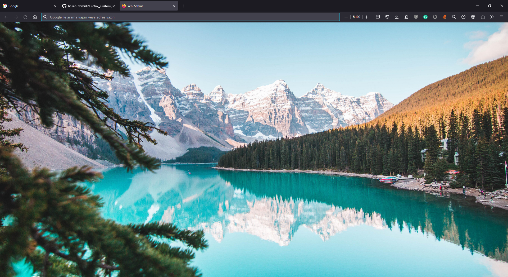
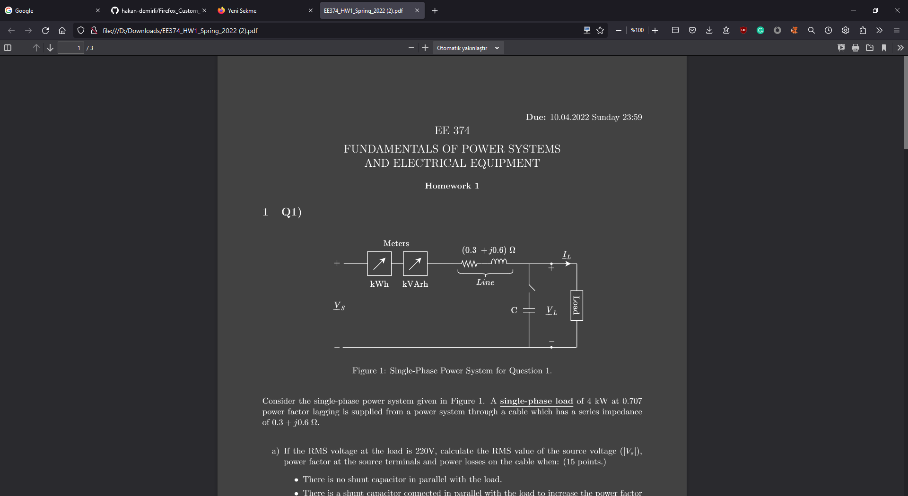
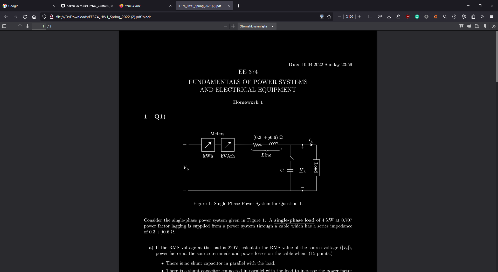
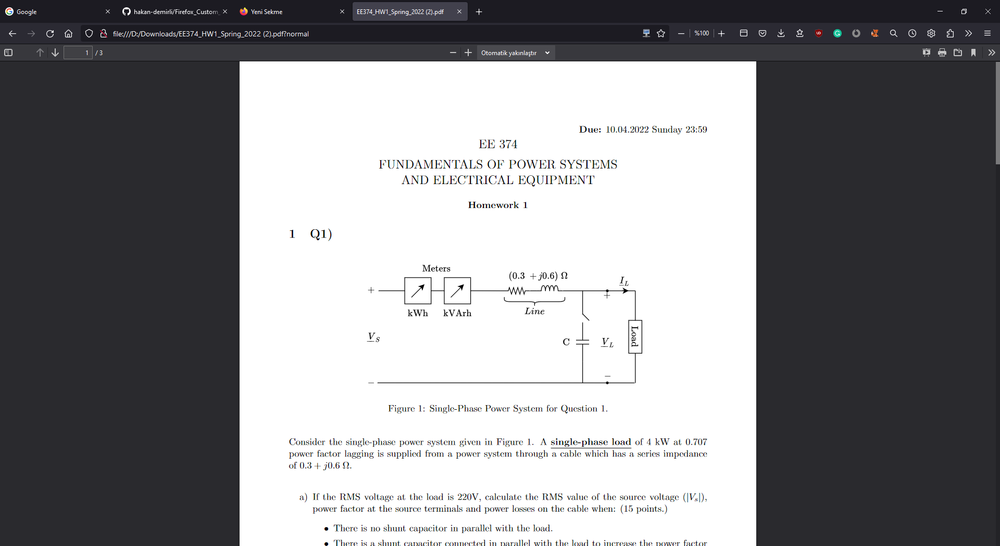
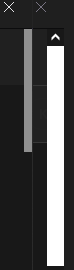

Firefox CSS theme to darkn the PDF files, thinner scroll bar and custom wallpaper on newtabs.

(Background: [View of Moraine Lake by Jaime Reimer](https://www.pexels.com/photo/beautiful-view-of-moraine-lake-2662116/))

# Demo & Setup
[Watch me on YouTube](https://youtu.be/SbcpgtgFYNU)

# Features

<div align="center">

### Custom wallpaper:  
 

### Dark PDF reader:  
 

### Black PDF reader:  
 

### Normal PDF reader:  
 

### Thinner scroll bars:  
 

 </div>


## Toggle PDF reader dark mode
- The default mode of PDF viewer is darkdefault. 
- To view original file, add ```?normal``` to the end of your pdf URL.
- To activate black mode (high contrast), add ```?black``` to the end of your pdf URL.

## Credits
  - https://github.com/hakan-demirli/Firefox_Custom_CSS
  - [r/FirefoxCSS](https://www.reddit.com/r/FirefoxCSS/)